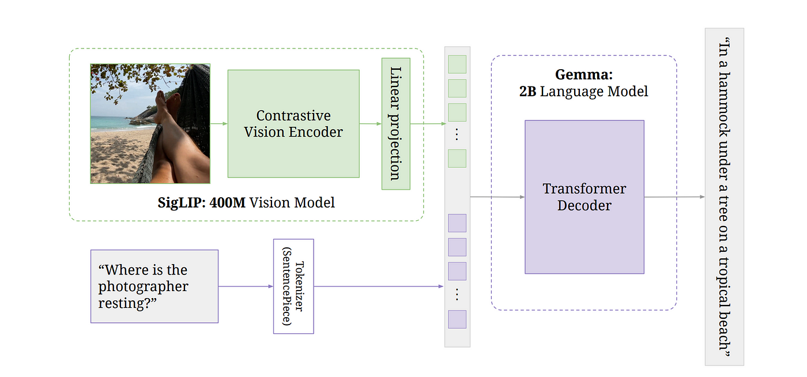

# Implementation of Vision Language Model From Scratch

_(Work in Progress...)_

This repository contains the implementation of a Vision-Language Model (VLM) built from scratch as a personal project. This model is inspired from the PaliGemma Model.

