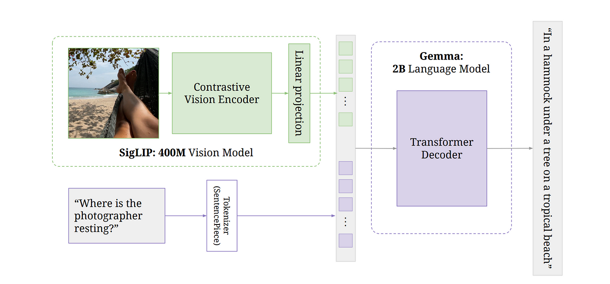
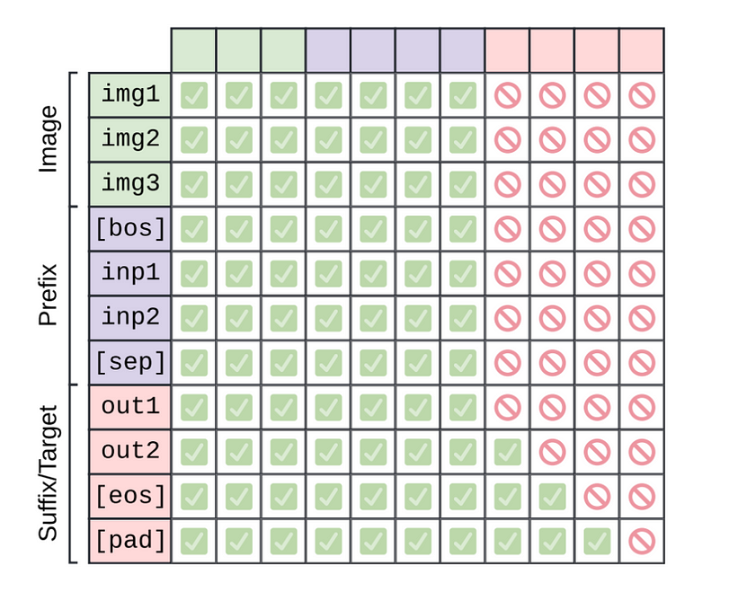
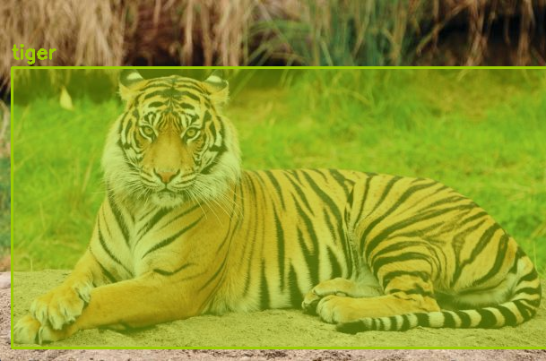

# PaliGemma VLM implementation From Scratch

_(Work in Progress...)_

This repository contains the re-implementation from scratch of a PaliGemma Vision-Language Model as a personal project.

- Some parts of the code are inspired by the HF implementation in order to load the model's weights and run the inference properly.

# Architecture



This VLM is composed of three main components:

- SigLIP, an image encoder which was constrastively pretrained at large scale with sigmoid loss. Achieved SoTA performance, especially for its small size.

- Gemma-2B, a decoder-only language model which has a great balance between performance and size.

- A linear layer that projects the SigLIP's output tokens to the same dimensions as Gemma 2B's vocab tokens, such that they can be concatenated.

The image is fed into the SigLIP encoder, which outputs a sequence of N<sub>img</sub> tokens. The text is converted into N<sub>txt</sub> tokens using the Gemma's Sentence Piece tokenizer and embedded with Gemma's vocabulary embedding layer. The image tokens are then projected with the linear layer. Then the sequence of image tokens and text tokens are concatenated and fed into the Gemma-2B decoder as follows:

<div align="center">
  
</div>

<br>

In this implementation, the images are always resized to 224x224 pixels (we work with the 224 version of the model), corresponding to 256 tokens which are always placed in the front. The BOS token then marks the start of text tokens and a `\u` is used as a separator token. But this separator is tokenized separatly to avoid it bering merged with with the end of the prefix or the beginning of the suffix. This model uses a full unmasked attention on the input (image + prefix) and the vanilla auto-regressive mask for the output (suffix).

# Key Architectural Insights

- The model leverages KV-cache. During inference, since we cache the keys and values of the previous tokens, we only process a single token at a time, so there is nothing to mask out. Obviously, during training, you still have a causal mask.
- Surprisingly, the model uses a full unmasked attention on the images tokens AND the prefix tokens !!! And an auto-regressive mask only for the output (suffix).
- KV-cache is used to store the keys and values of the previous tokens.
- Group Query Attention, slightly reduces the quality but increases the speed (as we reduce the quantity of data transfer which is the bottleneck of the attention mechanism) and reduces the memory consumption and therefore reduces the KV-cache size.
- RMS Normalization.
- Rotary Positional Embeddings.
- Top-p sampling.
- Temperature for sampling.
- GeLU activation function.

# Inference

First clone the repository and install the requirements:

```bash
git clone https://github.com/MaxLSB/vision-language-model.git
```
```bash
pip install -r requirements.txt
```
Then, download the weights from HF (see [Downloading Weights](#downloading-weights)). 

_In this implementation the name of instances and variables of the layers match the ones in the `model.safetensors.index.json` file, such that we can load the weights properly._

Finally, run `src/inference.py` file and pass the desired arguments (see [Inference Settings](#inference-settings)).


## Downloading Weights

You will need to download the PaliGemma weights from Hugging Face to perform inference (either the pretrained weights or the fine-tuned weights): 
- [PaliGemma 3B PT 224](https://huggingface.co/google/paligemma-3b-pt-224).
- [PaliGemma 3B mix 224](https://huggingface.co/google/paligemma-3b-mix-224).

To download the weights:

1. Create a Hugging Face access token with "Read" permissions.
2. Clone the repository by running the following command in the same directory as this repository:

```bash
git clone https://huggingface.co/google/paligemma-3b-pt-224
```
3. Use the access token as the password with your usename.

## Prompt

This isn't really a conversational model. But it is good at several tasks (even the pre-trained version) such as:

- Image captioning (prompt: 'Caption')
- Visual Question Answering (prompt: 'What is the animal?')
- Object detection (prompt: 'Detect \<entity\>')
- Segmentation (prompt: 'Segment \<entity\>')

**Example of a detection prompt with PaliGemma-3B-mix-224:**

```
> Input: Detect tiger
> Output: <loc0190><loc0022><loc0980><loc1023> tiger.
```

<div align="center">
  
</div>


## Inference Settings

| Argument               | Type   | Default                                                                 | Description                                                      |
|------------------------|--------|-------------------------------------------------------------------------|------------------------------------------------------------------|
| `--model_path`          | str    | `"/model/path/paligemma-3b-mix-224"` | Path to the model directory.                                     |
| `--prompt`              | str    | `"Detect tiger"`                                                       | Prompt text given to the model.                                  |
| `--detection`           | bool   | `True`                                                                  | Display object detection on the image (True/False). Must be used with a 'detect <entity>' prompt, with the fine-tuned model. |
| `--image_file_path`     | str    | `"your/image/tiger.jpg"` | Path to the input image file.                                    |
| `--max_tokens_to_generate` | int  | `100`                                                                  | Maximum number of tokens to generate.                            |
| `--temperature`         | float  | `0.8`                                                                   | Sampling temperature.                                            |
| `--top_p`               | float  | `0.9`                                                                   | Top-p sampling value.                                            |
| `--do_sample`           | bool   | `False`                                                                  | Enable sampling (True/False).                                    |
| `--only_cpu`            | bool   | `False`                                                                  | Run on CPU only (True/False).                                    |

# Next Steps

- Add a way to display the segmentation mask on the input image using a VQ-VAE model.
- Add other sampling methods.
- Make the generation token by token instead of generating all at once.
- Build a fine-tuning pipeline.
- Simplify the code.
